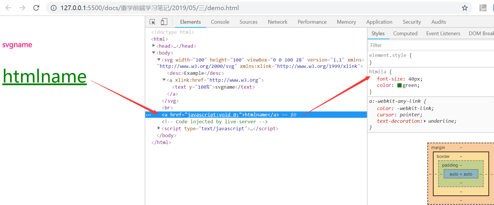
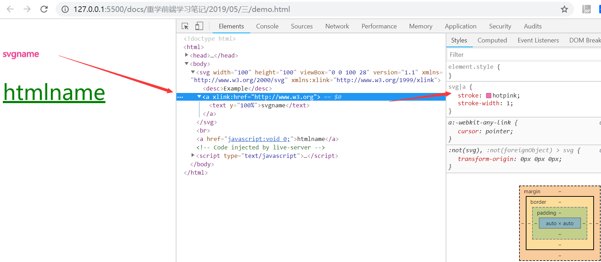
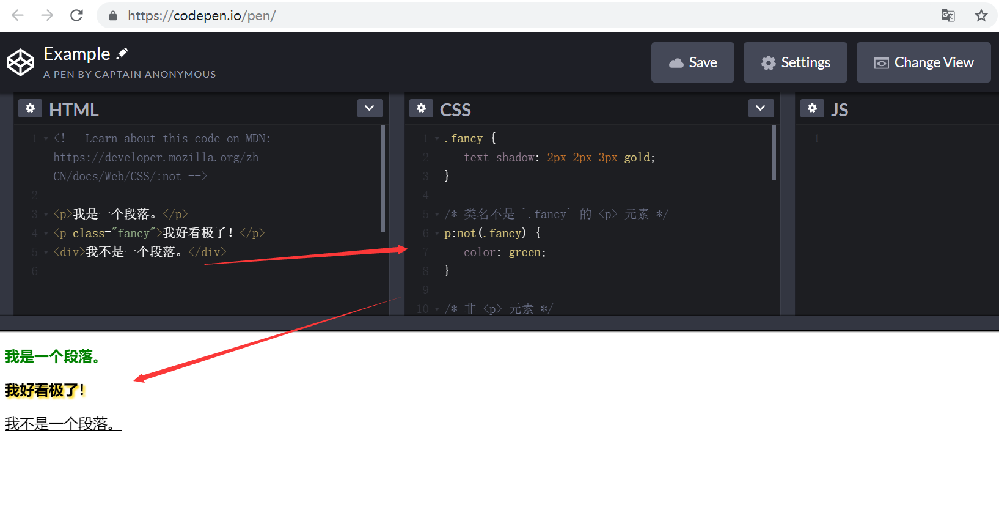

# 如何选中svg里的a元素？（二十一）

## 一、引言

> 本文讲一讲css选择器的一些机制。

## 二、选择器的基本意义

> 根据一些特征，选中元素树上的一批元素。

选择器的结构分类

- `简单选择器`：针对某一特征判断是否选中元素。
- `复合选择器`：连续写在一起的简单选择器，针对元素自身特征选择单个元素。
- `复杂选择器`：由“（空格）”“ &gt;”“ ~”“ +”“ ||”等符号连接的复合选择器，根据父元素或者前序元素检查单个元素。
- `选择器列表`：由逗号分隔的复杂选择器，表示“或”的关系。

## 三、简单选择器


### 3.1、类型选择器和全体选择器

`svg 和 html` 中都有 `a` 元素，若要想区分选择 `svg 中的 a` 和 `html 中的 a`，就必须用带`命名空间`的类型选择器。

> svg 元素在： [http://www.w3.org/2000/svg](http://www.w3.org/2000/svg) 命名空间之下。

```html
<!DOCTYPE html>
<html>

<head>
    <meta charset="utf-8">
    <title>namespace</title>
    <style>
        @namespace svg url(http://www.w3.org/2000/svg);
        @namespace html url(http://www.w3.org/1999/xhtml);

        svg|a {
            stroke: hotpink;
            stroke-width: 1;
        }

        html|a {
            font-size: 40px;
            color: green;
        }
    </style>
</head>

<body>
    <svg width="100" height="100"
        viewBox="0 0 100 50" version="1.1"
        xmlns="http://www.w3.org/2000/svg"
        xmlns:xlink="http://www.w3.org/1999/xlink">
        <desc>Example</desc>
        <a xlink:href="http://www.w3.org">
            <text y="100%">svgname</text>
        </a>
    </svg>
    <br />
    <a href="javascript:void 0;">htmlname</a>
</body>

</html>
```

如图所示：





### 3.2、id 选择器与 class 选择器

> `id` 选择器是 `#` 号后面跟随 `id` 名，`class` 选择器是 `.` 后面跟随 `class` 名。

```css
#myid {
  stroke: blue;
  stroke-width: 1;
}

.myclass {
  font-size: 40px
}
```

### 3.3、属性选择器

四中形态

- `[att]`：直接在方括号中放入属性名，是检查元素是否具有这个属性。
- `[att=val]`：精确匹配，检查一个元素属性的值是否是 val。
- `[att~=val]`：多种匹配，检查一个元素的值是否是若干值之一。
- `[att|=val]`：开头匹配，检查一个元素的值是否是以 val 开头，后面内容不管。

## 四、伪类选择器

### 4.1、树结构关系伪类选择器

- `:root`：伪类表示树的根元素。
- `:empty`：伪类表示没有子节点的元素。
- `:nth-child`：
- `:nth-last-child`：的区别仅仅是从后往前数。
- `:first-child :last-child`：分别表示第一个和最后一个元素。
- `:only-child`：选中唯一一个子元素。

### 4.2、链接与行为伪类选择器

- `:any-link`：表示任意的链接，包括 `a、area 和 link `标签都可能匹配到这个伪类。
- `:link`：表示未访问过的链接。
- `:visited`：表示已经访问过的链接。
- `:hover`：表示鼠标悬停在上的元素。
- `:active`：表示正在激活这个元素。
- `:focus`：表示焦点落在这个元素之上。
- `:target`：用于选中浏览器 `URL 的 hash` 部分所指示的元素。

### 4.3、逻辑伪类选择器

> `CSS 否定伪类 :not(X)`，是以一个简单的以选择器X为参数的功能性标记函数。它匹配不符合参数选择器X描述的元素。X不能包含另外一个否定选择器。[详情链接](https://developer.mozilla.org/zh-CN/docs/Web/CSS/:not#HTML)

```html
<p>我是一个段落。</p>
<p class="fancy">我好看极了！</p>
<div>我不是一个段落。</div>
```

```css
.fancy {
  text-shadow: 2px 2px 3px gold;
}

/* 类名不是 `.fancy` 的 <p> 元素 */
p:not(.fancy) {
  color: green;
}

/* 非 <p> 元素 */
body :not(p) {
  text-decoration: underline;
}

/* 非 <div> 或 <span> 的元素 */
body :not(div):not(span) {
  font-weight: bold;
}

/* 类名不是 `.crazy` or `.fancy` 的元素 */
/* 注意，此语法尚未被较好地支持。 */
body :not(.crazy, .fancy) {
  font-family: sans-serif;
}
```

结果如图：（[可以打开：https://codepen.io/pen/ 进行代码编写，查看效果](https://codepen.io/pen/)）



### 4.4、其它伪类选择器

- `国际化`：用于处理国际化和多语言问题。
    + `dir`
    + `lang`
- `音频 / 视频`：用于区分音视频播放状态。
    + `play`
    + `pause`
- `时序`：用于配合读屏软件等时序性客户端的伪类。
    + `current`
    + `past`
    + `future`
- `表格`：用于处理 `table` 的列的伪类。
    + `nth-col`
    + `nth-last-col`
