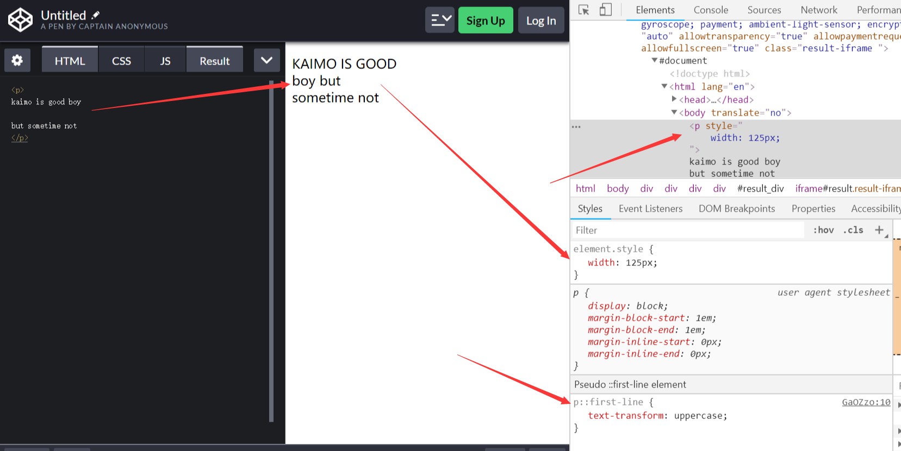
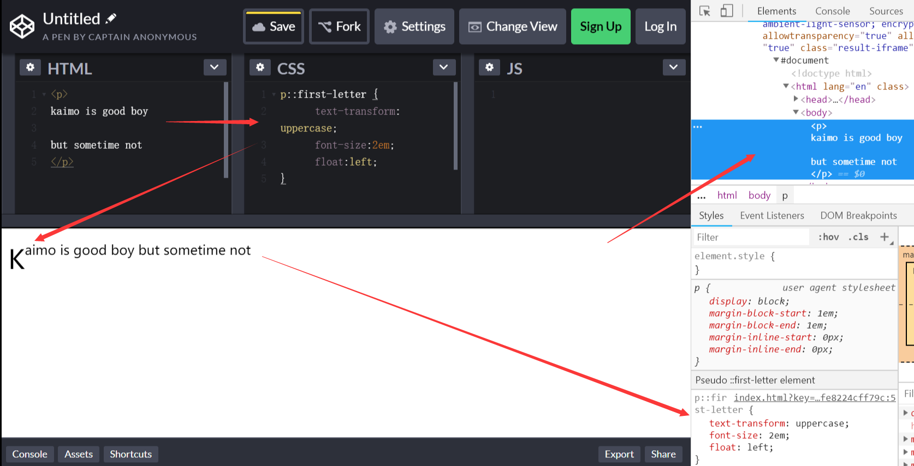
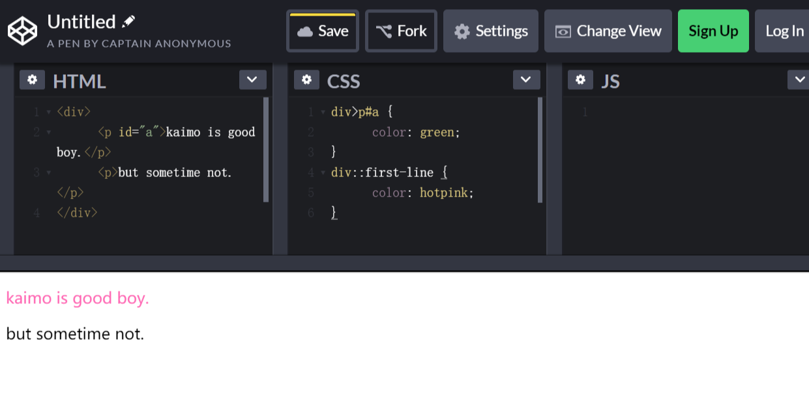
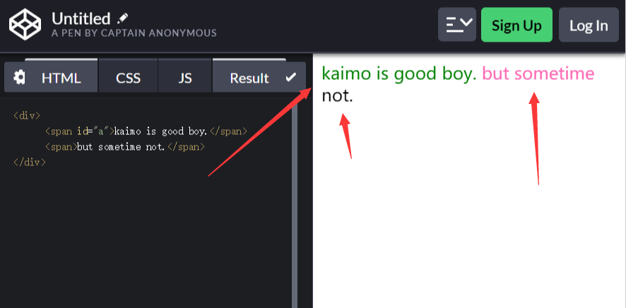
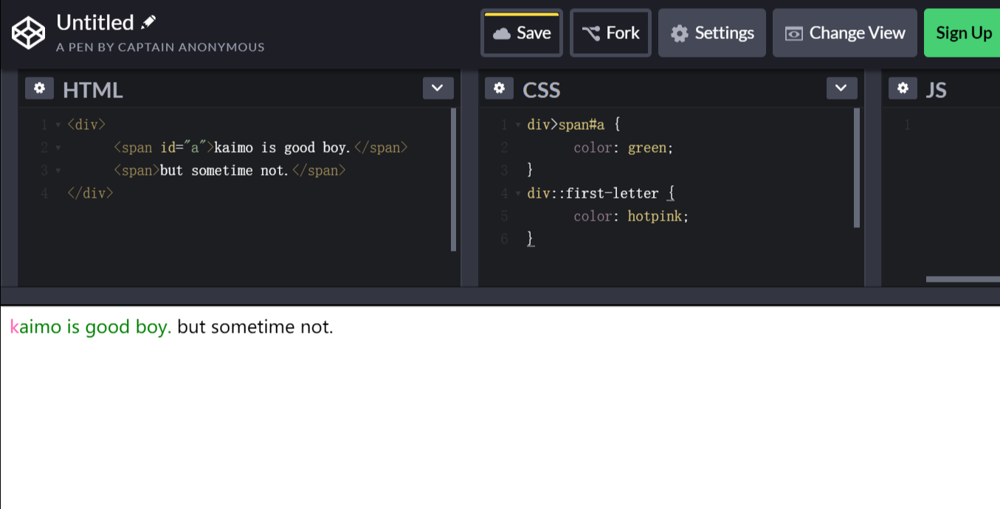

# 选择器的机制（二十二）

## 一、引言

> 本文讲一讲选择器的几个机制：选择器的组合、选择器的优先级和伪元素。

## 二、选择器的组合

### 2.1、选择器列表

> 选择器列表：用逗号分隔的复杂选择器序列；复杂选择器则是用`空格、大于号、波浪线`等符号连接的复合选择器；复合选择器则是连写的简单选择器组合。

### 2.2、优先级

- 第一优先级
  + 无连接符号
- 第二优先级
  + `空格`
  + `~`
  + `+`
  + `>`
  + `||`
- 第三优先级
  + `,`

### 2.3、复杂选择器的连接符号

- `空格`：表示选中所有符合条件的后代节点。`（后代）`
- `>`：表示选中符合条件的子节点。`（子代）`
- `~`：表示选中所有符合条件的后继节点，后继节点即跟当前节点具有同一个父元素，并出现在它之后的节点。`（后继）`
- `+`：表示选中符合条件的直接后继节点，直接后继节点即 `nextSlibling`。`（直接后继）`
- `||`：表示选中对应列中符合条件的单元格。`（列选择器）`

## 三、选择器的优先级

> CSS 标准用一个`三元组 (a, b, c)` 来构成一个复杂选择器的优先级。CSS 建议用一个足够大的进制，获取“ `a-b-c` ”来表示选择器优先级。

```js
// base 是一个"足够大"的正整数
specificity = base * base * a + base * b + c
```

- `id` 选择器的数目记为 `a`
- 伪类选择器和 `class` 选择器的数目记为 `b`
- 伪元素选择器和标签选择器数目记为 `c`
- “*” 不影响优先级。

**注意**：行内属性的优先级永远高于 CSS 规则，浏览器提供了一个`口子`就是添加`!important`。该优先级会高于行内属性。`同一优先级`的选择器遵循`后面的覆盖前面的`原则。

## 四、伪元素

> 伪元素本身不单单是一种选择规则，它还是一种机制。

- `::first-line`
- `::first-letter`
- `::before`
- `::after`

### 4.1、::first-line 和 ::first-letter

> 代码测试连接：[https://codepen.io/pen/](https://codepen.io/pen/)

1、`::first-line`

```html
<p>
kaimo is good boy.

but sometime not.
</p>
```

```css
p::first-line {
    text-transform: uppercase
}
```



**注意**：排版后显示的第一行字母变为大写。跟 HTML 代码中的换行无关。

2、`::first-letter`

```css
p::first-letter {
    text-transform: uppercase;
    font-size:2em;
    float:left;
}
```



3、`::first-line`必须出现在最内层的块级元素内。

```html
<div>
    <p id="a">kaimo is good boy.</p>
    <p>but sometime not.</p>
</div>
```

```css
div>p#a {
    color: green;
}
div::first-line {
    color: hotpink;
}
```



如果将`p`标签替换成`span`标签

```html
<div>
    <span id="a">kaimo is good boy.</span>
    <span>but sometime not.</span>
</div>
```

```css
div>span#a {
    color: green;
}
div::first-line {
    color: hotpink;
}
```



如果你理解了出现三种颜色的原因，那就证明你清楚明白了。

4、`::first-letter` 出现在所有标签之内

```html
<div>
    <span id="a">kaimo is good boy.</span>
    <span>but sometime not.</span>
</div>
```

```css
div>span#a {
    color: green;
}
div::first-letter {
    color: hotpink;
}
```



5、相关属性


### 4.2、::before 和 ::after

> `::before` 表示在元素内容之前插入一个虚拟的元素，`::after` 则表示在元素内容之后插入。

两个伪元素必须指定 `content` 属性才会生效。

## 拓展

另外补充一下：可以查看MDN `伪类（pseudo-class）`[https://developer.mozilla.org/zh-CN/docs/Learn/CSS/Introduction_to_CSS/Pseudo-classes_and_pseudo-elements](https://developer.mozilla.org/zh-CN/docs/Learn/CSS/Introduction_to_CSS/Pseudo-classes_and_pseudo-elements)