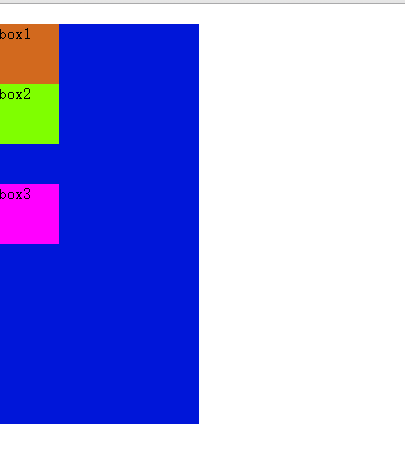

# CSS的正常流（二十五）

## 一、正常流的行为

> 正常流的排版行为：依次排列，排不下了换行。

### 1.1、float

> 在正常流基础上，有 `float` 相关规则，使得一些盒占据了正常流需要的空间，可以把 `float` 理解为`文字环绕`。


### 1.2、vertical-align

> 有 `vertical-align` 相关规则规定了如何在垂直方向对齐盒。基线、文字顶 / 底、行顶 / 底等概念。


### 1.3、margin 折叠

1、参考文章：[CSS中margin折叠问题记录](https://www.cnblogs.com/hot-destiny/p/6285536.html)

2、块级格式上下文`Block Formatting Context`（简称 BFC）

> Web页面的一种布局方式，通俗点说，也是指页面上一个渲染区域，里面的元素按文档流中的顺序垂直排列，并且发生垂直方向上的 `margin折叠`，同时这个区域内的元素布局不会对外面的元素有任何影响。

3、产生一个BFC：当元素满足一下任何一个条件

- `float` 属性取值不是 `none`
- `overflow` 属性取值不是 `visible`
- `display` 的值为 `table-cell, table-caption, inline-block` 中的任何一个
- `position` 的值不为 `static 或 relative` 中的任何一个

4、BFC 内部垂直方向上的 margin折叠

可以用[https://codepen.io/pen/](https://codepen.io/pen/)测试：

```html
<div id="father">
     <div id="first-child">box1</div>
     <div id="second-child">box2</div>
     <div id="three-child">box3</div>
</div>
```

```css
*{
     margin: 0;
     padding: 0;
}
#father{
     width: 2000px;
     height: 400px;
     background: #0016d9;
}
#first-child{
     margin-top: 20px;
     background: chocolate;
     width: 60px;
     height: 60px;
}
#second-child{
     background: chartreuse;
     width: 60px;
     height: 60px;
     margin-bottom: 20px;
}
#three-child{
     margin-top:40px;
     background: fuchsia;
     width: 60px;
     height: 60px;
}
```

这段代码渲染出来的结果：



可以看出 box1 距离 body 上边 20px，而 box2 和 box3 之间距离 40px，就是因为发生了折叠。body就是一个BFC，里面元素会发生margin折叠。

5、折叠现象去除

```html
<!-- 添加一个层级加上overflow: hidden以及float: left -->
<div id="father">
     <div id="first-child">box1</div>
     <div style="overflow: hidden">
          <div id="second-child">box2</div>
     </div>
     <div style="float: left">
          <div id="three-child">box3</div>
     </div>
</div>
```

```css
/*  添加overflow: hidden; */
#father{
     overflow: hidden;
}
```

这样就可以得到我们想要的效果：


## 二、正常流的原理

> 在 CSS 标准中，规定了如何排布每一个文字或者盒的算法，这个算法依赖一个排版的`当前状态`，CSS 把这个当前状态称为`格式化上下文（formatting context）`。

### 2.1、排版过程

```js
格式化上下文 + 盒 / 文字 = 位置

formatting context + boxes/charater = positions
```

### 2.2、块级盒和行内级盒排版

> 排版需要分别为它们规定了块级格式化上下文和行内级格式化上下文。

1、块级格式化上下文顺次排列元素：


2、行内级格式化上下文顺次排列元素：


3、正常流中的一个盒或者文字排版，需要分成三种情况处理

- **当遇到块级盒**：排入块级格式化上下文。
- **当遇到行内级盒或者文字**：首先尝试排入行内级格式化上下文，如果排不下，那么创建一个行盒，先将行盒排版（行盒是块级，所以到第一种情况），行盒会创建一个行内级格式化上下文。
- **遇到 float 盒**：把盒的顶部跟当前行内级上下文上边缘对齐，然后根据 float 的方向把盒的对应边缘对到块级格式化上下文的边缘，之后重排当前行盒。

## 三、正常流的使用技巧

### 3.1、等分布局问题

1、采用百分比宽度解决

```html
<div class="outer">
    <div class="inner"></div>
    <div class="inner"></div>
    <div class="inner"></div>
</div>
.inner {
    width:33.33%;
    height:300px;
    display:inline-block;
    outline:solid 1px blue;
}
```

2、上面 1 的代码每个 div 并非紧挨，中间有空白，因为为了代码格式加入的换行和空格被 HTML 当作空格文本，跟 inline 盒混排了的缘故。

```html
<!-- 去掉空格和换行 -->
<div class="outer"><div class="inner"></div><div class="inner"></div><div class="inner"></div></div>
```

3、上面 2 的做法影响代码可读性

```css
/* 解决方案：设置 outer 中的字号为 0 */
.inner {
    width:33.33%;
    height:300px;
    display:inline-block;
    outline:solid 1px blue;
    font-size:30px;
}
.outer {
    font-size:0;
}
```

4、在某些浏览器中，因为像素计算精度问题，还是会出现换行

```css
/*  解决方案：给 outer 添加一个特定宽度 */
.inner {
    width:33.33%;
    height:300px;
    display:inline-block;
    outline:solid 1px blue;
}
.outer {
    width:101px
}
```

5、这个代码在某些旧版本浏览器中会出现换行

```css
/* 解决方案：给最后一个 div 加上一个负的右 margin */
.outer {
    width:101px
}

.inner {
    width:33.33%;
    height:300px;
    display:inline-block;
    outline:solid 1px blue;
}

.inner:last-child {
    margin-right:-5px;
}
```

### 3.2、自适应宽

> 自适应宽（一个元素固定宽度，另一个元素填满父容器剩余宽度）是个经典的布局问题。

1、如何使用正常流来解决？

```html
<!-- div.fixed是固定宽度的，需要添加css让div.auto填满剩余宽度 -->
<div class="outer">
    <div class="fixed"></div>
    <div class="auto"></div>
</div>
```

```css
.fixed {
    width:200px;
}
.fixed, .auto {
    height:300px;
    outline:solid 1px blue;
}
```

2、利用负 margin

```css
.fixed {
    display:inline-block;
    vertical-align:top;
}
.auto {
    margin-left:-200px;
    width:100%;
    display:inline-block;
    vertical-align:top;
}
```

这样做会导致 auto 中的内容位置不对，还需要使用 padding 把内容挤出来，最终完整代码如下：

```css
.fixed {
    display:inline-block;
    vertical-align:top;
}
/* 给 auto 添加 padding-left 和 box-sizing 两个属性 */
.auto {
    margin-left:-200px;
    padding-left:200px;
    box-sizing:border-box;
    width:100%;
    display:inline-block;
    vertical-align:top;
}
```
