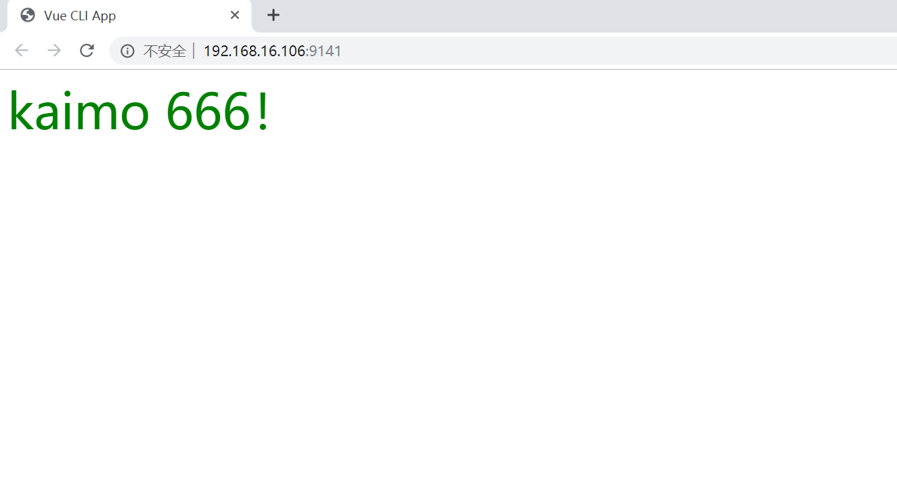

## 问题

> 比如我们在开发一个组件，以及做一些小demo的时候，怎么快速启动服务？

## 解决

### 1、安装拓展

```powershell
npm install -g @vue/cli-service-global
```

### 2、新建vue文件

> 建立一个vue-test文件夹，在里面新建一个kaimo.vue文件，写上vue代码。

```vue
<template>
  <div class="kaimo">{{ msg }}</div>
</template>
<script>
export default {
    data() {
        return {
            msg: 'kaimo 666！'
        }
    }
}
</script>
<style>
.kaimo {
    color: green;
    font-size: 48px;
}
</style>
```

### 3、启动服务

> 打开vscode的终端，输入下面的命令然后回车。

```powershell
vue serve kaimo.vue
```


### 4、启动成功

> 启动成功之后，vue-test文件夹里会多一个node_modules文件夹，ctrl+鼠标左键，点击链接就会出现下面页面。



### 5、打包

> 在vscode终端中结束服务，输入下面命令进行打包，成功之后可以看到vue-test文件夹里会多出一个dist文件夹，里面包含index.html，js，css。

```po
vue build kaimo.vue
```

